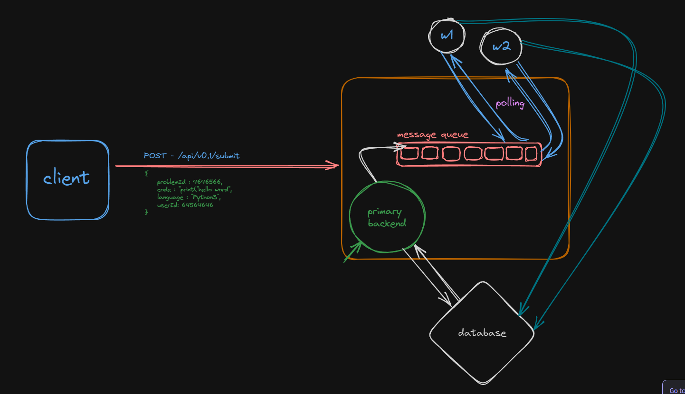

<a name="readme-top"></a>

<br />
<div align="center">
  
 
<a href="https://github.com/Puskar-Roy/Attendance-System---Backend">
    
  </a>
  
<h3 align="center">Talking to redis via Node.js 💻 </h3>
  
</div>

##### Note: _There are various clients that exist that let you talk to redis via Node.js._

```bash
https://www.npmjs.com/package/redis

```

## About This Project 🌟

Let’s initialize a simple Node.js express server that takes a problem submission (very similar to leetcode) as input and sends it to the queue
Let’s also create a worker service that picks up a problem, waits for 2 seconds and then proceeds to pick the next one

## Architecture 💻





## Getting Started 🚀

### Prerequisites

Before you begin contributing to this project, make sure you have the following set up:

- [Node.js](https://nodejs.org/): A JavaScript runtime.
- [npm](https://www.npmjs.com/): The Node.js package manager.

### Run This ⌨️

1. **Clone the Repository:**
   ```bash
   git clone https://github.com/Puskar-Roy/Talking-to-Redis-via-Node.js
   ```
2. **Install Dependencies:**
   ```bash
    #Express Server
    cd express-server/npm install

    #Workers
    cd worker/npm install
   ```

3. **Build and Run This Project:**

   ```bash
   #for Express Server
   cd express-server/npm run build
   cd express-server/npm run dev


   #for Express Server
   cd worker/npm run build
   cd worker/npm run dev
   ```


<p align="right">(<a href="#readme-top">back to top</a>)</p>

### Puskar Roy🖋️
